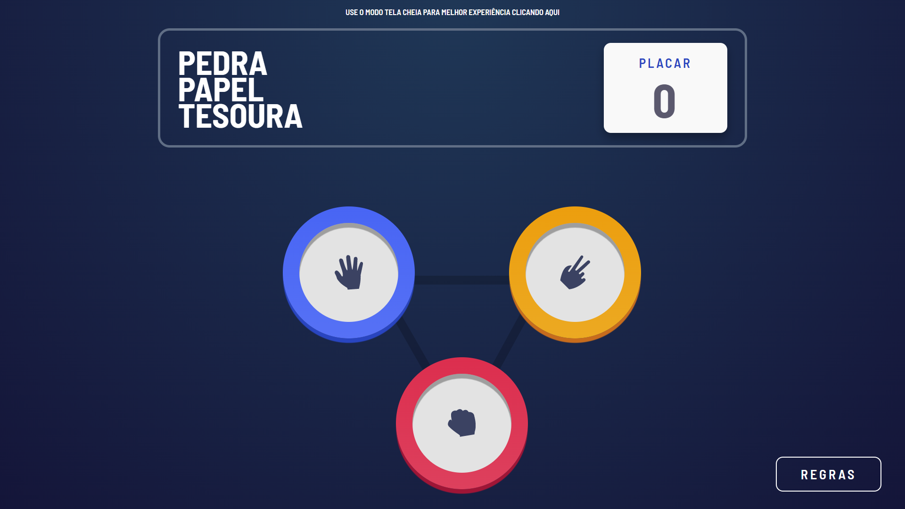
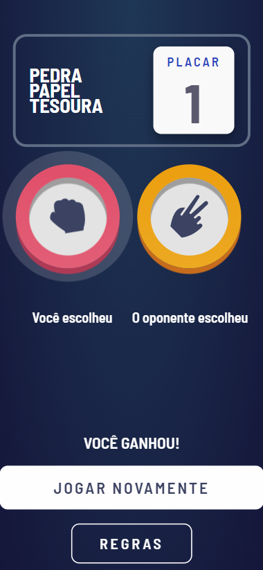

# Frontend Mentor - Pedra, Papel, Tesoura solução

Esta é uma solução para o desafio [Pedra, Papel, Tesoura do Frontend Mentor](https://www.frontendmentor.io/challenges/rock-paper-scissors-game-pTgwgvgH).

## Table of contents

- [Visão Geral](#Visão-Geral)
  - [O Desafio](#O-Desafio)
  - [Screenshot](#screenshot)
  - [Links](#links)
- [Construido em](#Construido-em)
- [Useful resources](#useful-resources)
- [Author](#author)

## Visão Geral

### O Desafio

Seu desafio é construir este jogo de Pedra, Papel e Tesoura e deixá-lo o mais próximo possível do design.

Você pode usar qualquer ferramenta que desejar para ajudá-lo a completar o desafio. Então, se você tem algo que gostaria de praticar, sinta-se à vontade para tentar.

Seus usuários devem ser capazes de:

- Veja o layout ideal para o jogo, dependendo do tamanho da tela do dispositivo
- Jogue Pedra, Papel, Tesoura contra o computador
- Manter o estado da pontuação após atualizar o navegador _(opcional)_

### Screenshot

Tela Desktop

Tela mobile

### Links

- Solução URL: [Solução ](https://your-solution-url.com)
- Site URL: [Desafio Pedra Papel Tesoura](https://victor-vrg.github.io/Desafio-Pedra-Papel-Tesoura/)

### Construido em

- HTML5
- CSS Grid
- JavaScript

### Recursos úteis

- [BOXY SVG](https://boxy-svg.com/) - E uma ferramenta de edição de arquivos SVG online
- [Example resource 2](https://www.example.com) - This is an amazing article which helped me finally understand XYZ. I'd recommend it to anyone still learning this concept.

## Autor

- Website - [Victor Resende](https://www.your-site.com)
- Frontend Mentor - [Victor-vrg](https://www.frontendmentor.io/profile/Victor-vrg)
- Linkedin - [@victorvrg](https://www.linkedin.com/in/victorvrg/)
